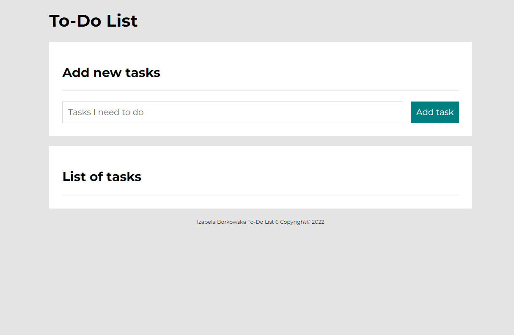

# Izabela Borkowska -To Do List

### DEMO: https://izabelaborkowska.github.io/to-do-list/

### Description

I have created a simple to-do list as part of my Front End course.
You can use it to add new tasks and create a list below.
You can mark your tasks as done and/or remove them from the list.

In this project I used:

- HTML
- CSS
- Java Script
- Media queries
- BEM convention

I am studying frontend development with Youcode and this project was created as part of my training.

Presentation of my project:

